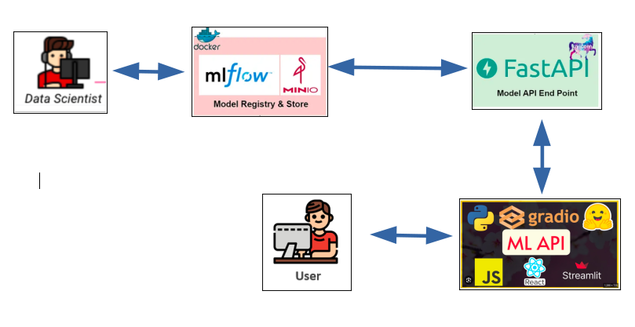

# Mlops-Project
Mise en place d’une architecture pour l’expérimentation et le déploiement des modèles d’apprentissage automatique

## Architecture
Cette architecture complète crée un processus fluide et automatisé pour le déploiement, la gestion et la mise à jour de modèles de machine learning.

